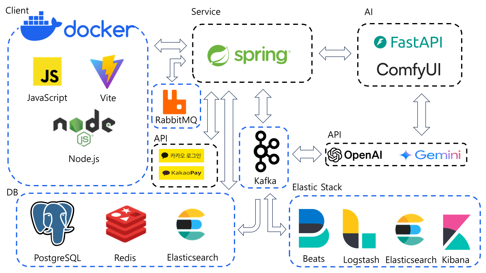

# 🧟 HeroFactory
> 1인 게임 개발자를 위한 AI 기반 게임 리소스 생성 및 스토어 플랫폼

## 📦 Related Repositories
- [hero-factory-client](https://github.com/AI-Team-02/hero-factory-client) - 프론트엔드
- [hero-factoey-service](https://github.com/AI-Team-02/hero-factoey-service) - 백엔드 📍 You are here
- [hero-factory-ai](https://github.com/AI-Team-02/hero-factory-ai) - AI 서비스

## 📌 Quick Links

## 📝 목차
1. [서비스 소개](#outline)
2. [주요 기능](#features)
3. [기술 스택](#skill)
4. [시스템 아키텍처](#structure)
5. [팀원 소개](#role)
6. [기술 스택 선정 이유](#why)
7. [프로젝트 회고](#retrospection)

## 🎮 서비스 소개 

### 서비스 개요
게임 개발자들이 스케치만으로 고품질의 게임 리소스를 자동 생성하고, 필수 게임 리소스를 구매할 수 있는 AI 기반 구독형 서비스

### Pain Points & Solutions

#### 1. 디자이너 부재로 인한 퀄리티 저하
- **Problem**: 1인 개발 환경에서 전문 디자이너 부재
- **Solution**: ComfyUI 기반 AI로 스케치에서 고품질 리소스 자동 생성

#### 2. 리소스 제작 비용 문제
- **Problem**: UI, 캐릭터, 아이템 등 다양한 리소스 제작 비용 부담
- **Solution**: AI 생성 + 마켓플레이스를 통한 비용 효율화

## ⚡ 주요 기능 

### 1. AI 리소스 생성
- 스케치 기반 이미지 생성
  - ComfyUI를 활용한 고품질 이미지 생성
  - 간단한 스케치와 텍스트 기반 이미지 생성
- Gemini API 활용 프롬프트 최적화
  - 자연어 설명을 AI 프롬프트로 변환
  - 세부 스타일 및 디테일 반영

### 2. 게임 리소스 스토어
- 검증된 고품질 리소스 판매
  - UI/UX 요소
  - 캐릭터/아이템 이미지
  - 배경/이펙트 에셋
- Elasticsearch 기반 실시간 검색
  - 한글 형태소 분석기 적용
  - 다중 필드 통합 검색
- OpenAI 기반 콘텐츠 자동 검수
  - 자동화된 콘텐츠 관리

## 🛠 기술 스택 
#### Backend & Database

#### Message Brokers & Infrastructure

#### Elastic Stack

#### AI & Python Stack

#### Frontend & JavaScript

## 🎨 외부 API 

### Payment

- 정기 결제(구독)
- 단건 결제

### Authentication

- OAuth 2.0 기반 인증

### AI/ML

- 콘텐츠 검수
- 프롬프트 최적화
- 프롬프트 추천어

## 🤖 AI 모델 상세 

### Base Model
- **Juggernaut XL - Lightning V9**
  - 빠른 이미지 생성 속도 (Lightning)
  - 고품질 이미지 생성

### ControlNet & LoRA
- **controlnet-scribble-sdxl-1.0**
    - 스케치 기반 이미지 생성
- **Pixel Art XL**
    - 픽셀아트 스타일 특화
- **Game Icon | Diablo Style**
    - 게임 아이콘 생성 최적화

## 📊 시스템 아키텍처 

## 👥 팀원 소개 
| 이름 | 역할 | 담당 업무 |
|------|------|-----------|
| [김기정](https://github.com/kimkkkkj) | Design & Publishing | - 전체 UI/UX 디자인 - 웹 퍼블리싱 - 메인/상점/결제 페이지 |
| [변성일](https://github.com/i-Veni-Vidi-Vici) | Backend & AI | - ComfyUI Workflow 개발 - 스토어 서비스 개발 - 검색 엔진 최적화 - 로그 분석 시스템 구축 |
| [김재현](https://github.com/DTRT91) | Backend | - 결제 시스템 구현 - 프롬프트 추천 기능 개발 |
| ~~김연찬~~ | ~~Frontend & DevOps~~ | ~~- 프론트엔드 개발 - 배포 환경 구축~~ ❌ |

### 🫂 협업 방식 
##### GitHub Projects
- 백로그 작성 및 일정 관리
- 작업 상태 및 진행 상황 시각화

##### Notion
- 문서화 및 자료 공유
- 회의록, 기술 자료, 참고 자료 관리
- 
##### 데일리 스크럼
- 매일 짧은 회의를 통해 진행 상황 공유
- 문제점 논의 및 해결 방안 도출

### 🛥️ 기술 스택 선정 이유 
- Redis - 토큰 관리
- Elasticsearch - 검색 엔진
- Kafka - 데이터 스트림 처리
- Elastic Stack - 로그 분석
#### 1️⃣ Redis

##### 문제
- 토큰 탈취 시 보안 문제 발생
- 로그아웃 시 서버에 토큰 저장 필요
- 매 요청마다 서버에 저장된 데이터와 비교 검증 필요

##### 해결
- 인메모리 DB Redis 사용으로 빠른 처리 가능
- Access Token과 Refresh Token을 저장하지 않고, Refresh Token을 활용하여 로그아웃 및 토큰 탈취를 효율적으로 관리

##### 관련 이슈
- 토큰 탈취 문제 #26
- 로그아웃 처리 #27
- Refresh Token 만료 처리 #28

#### 2️⃣ Elasticsearch
##### 문제
- 상점 검색 성능의 저하
- PostgreSQL에서 LIKE '%문자%' 쿼리의 인덱싱 한계(특히 한국어)
- 다양한 필드(이름, 설명, 태그 등)에 대한 검색 요구 증가 

##### 해결
- Elasticsearch 도입으로 LIKE '%문자%' 쿼리 대체
- nori 한글 형태소 분석기를 활용한 인덱싱으로 검색 성능 최적화
- 다양한 필드(아이템 이름, 설명, 카테고리 ,태그)를 인덱스 하여 효과적으로 검색
- 특정 필드는 PostgreSQL, 검색은 Elasticsearch를 활용해 역할 분리

##### 관련 이슈
- 검색 성능 문제 #42
- 검색 index scan 오류 #43
- Elasticsearch 환경 구축 & 테스트 #44
- 아이템 Elasticsearch 검색엔진 적용 #46
- ES 아이템 검색 조건 추가 #47
- 게시글 상세 조회의 역할 #49

#### 3️⃣ Kafka
##### 문제
- 상점 키워드 검색과 상세 조회의 분리로 상점의 원천 데이터의 저장의 필요성과 원천 데이터의 가공 처리가 필요해짐
- 서버와 db가 1대1 매핑되는 시스템에서는 데이터 흐름 관점에서 한계가 명확히 보임
    - 하나의 서비스 로직(게시글 생성)에 너무 많은 부하가 걸림 (PostgreSQL에 원천 데이터 저장 + Elasticsearch에 인덱스)
    - 사용자가 하나의 서비스 로직에서 동기적 처리로 인한 부담을 져야할 이유가 전혀 존재하지 않음
    - 비동기 처리가 필요해짐
- 게시글을 생성하는 과정에서 검수에 대한 요구 증가
  - 데이터 흐름의 확장성 고려가 필요해짐

##### 해결
- 서비스가 점정 확장하면서, 데이터의 흐름과 처리의 확장성과 안정성을 위해 현재 적용중인 RabbitMQ 대신 Kafka를 도입
- 대규모 데이터의 실시간 처리와 전달 가능
- 데이터 흐름을 효과적으로 관리
  - 서비스 로직이 분리되고, 각 로직들이 비동기로 처리되어짐
  - 원천데이터로부터 Open AI를 통해 검수과정을 거친 후, 가공하여 Elasticsearch에 인덱스 하는 데이터의 흐름을 효과적으로 처리

##### 관련 이슈
- 게시글 상세 조회의 역할 #49
- 카프카 적용 #50
- 아키텍처 research #51
- 생성된 아이템 게시글 검수 기능 #52

#### 4️⃣ Elastic Stack
##### 문제
- 서비스 상태 모니터링 및 데이터 분석 요구 증가
- "없는 상품"에 대한 검색어 데이터를 상점 아이템 등록에 활용
- 많이 본 상품 기반 유사 아이템 추가 필요

##### 해결
- 기존에 도입한 Elasticsearch와 kafka 기술을 활용하여, Elastic Stack으로 로그 수집 & 처리
- API 상태 분석, 에러 모니터링, 인기 검색어 & 인기 상품 대시보드 생성

##### 관련 이슈
- Elastic Stack + kafka를 통한 로그 처리 #54

### 📌 소감 
김기정
- 협업할 수 있는 좋은 기회였으나, 팀원의 이탈로 인해 프로젝트의 완성도를 충분히 높이지 못한 점이 아쉬움으로 남습니다. 그럼에도 팀원들과 함께했던 시간은 뜻깊었습니다.

변성일
- 빠르게 발전하는 AI 기술을 따라가는 것은 쉽지 않았지만, 단순히 AI API를 사용하는 데 그치지 않고, 서비스의 특성과 요구에 맞는 AI 모델을 선정하고 이를 커스터마이징한 경험은 매우 의미 있었습니다. 이러한 과정에서 AI 기술에 대한 이해도를 높이고, 실질적인 적용 능력을 키울 수 있었습니다.
- 특히 팀원들과의 소통과 협력을 통해 제 자신의 강점과 약점을 더욱 명확히 인식할 수 있었고, 이를 개선하기 위해 노력했던 점이 인상 깊게 남아 있습니다. 프로젝트를 진행하며 쌓은 경험과 배움이 앞으로의 성장에 큰 밑거름이 될 것이라 확신합니다.

김재현
- 개인적인 사정으로 마지막까지 함께하지 못한 점이 아쉬웠지만, 새로운 기술을 접하고 팀과 협업하며 많은 것을 배울 수 있었던 값진 경험이었습니다.

